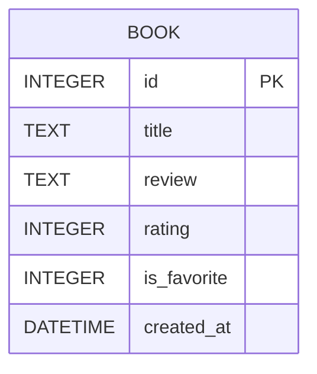

# 讀書筆記本系統 - 資料庫設計 (DB Design)

## 1. ER 圖 (實體關係圖)

## 2. 資料表詳細說明

### `books` 資料表
負責儲存使用者的書籍紀錄、心得、評分與收藏狀態。

| 欄位名稱 | 型別 | 必填 | 說明 |
| -------- | ---- | ---- | ---- |
| `id` | INTEGER | 是 | Primary Key，自動遞增的唯一識別碼 |
| `title` | TEXT | 是 | 書籍名稱 |
| `review` | TEXT | 否 | 讀後心得 |
| `rating` | INTEGER | 否 | 書籍評分 (例如：1~5) |
| `is_favorite` | INTEGER | 否 | 收藏狀態，0 為未收藏，1 為已收藏，預設為 0 |
| `created_at` | DATETIME | 是 | 紀錄建立時間，預設為 `CURRENT_TIMESTAMP` |

## 3. SQL 建表語法

完整的 SQLite CREATE TABLE 語法已儲存於 `database/schema.sql` 檔案中。

## 4. Python Model 程式碼

針對 SQLite 資料庫操作的 Python Model 已儲存於 `app/models/book_model.py`。
我們使用了 Python 內建的 `sqlite3` 模組，並實作了完整的 CRUD（新增、讀取、更新、刪除）以及搜尋與收藏切換的函式。
