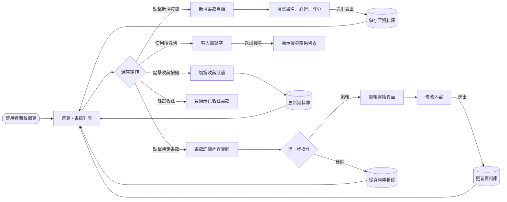
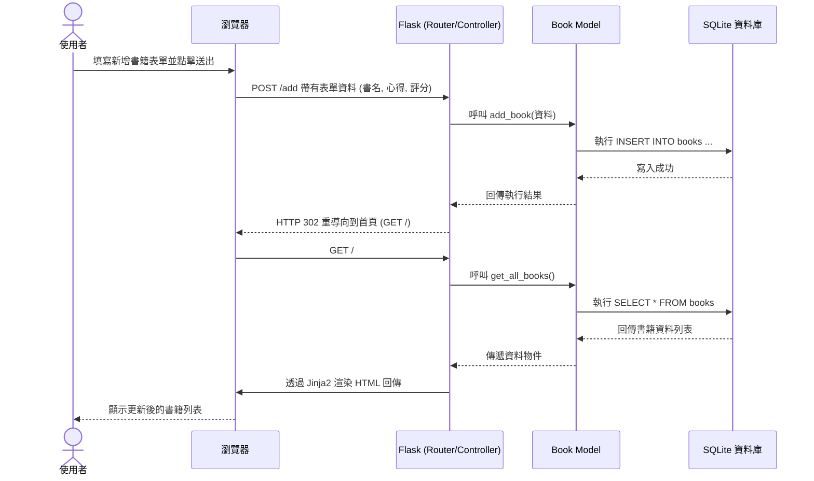

# 讀書筆記本系統 - 流程圖 (Flowchart)

## 1. 使用者流程圖 (User Flow)

此流程圖展示了使用者在系統中的主要操作路徑，包含瀏覽書籍、新增與管理紀錄，以及搜尋與收藏功能。

## 2. 系統序列圖 (Sequence Diagram)

此序列圖描述了「使用者點擊新增書籍並送出表單」到「資料存入資料庫」的完整技術運作流程。

## 3. 功能清單對照表

本表列出了 PRD 中定義的主要功能，及其預計對應的 URL 路徑與 HTTP 方法。

| 功能描述 | HTTP 方法 | URL 路徑 | 負責動作說明 |
| -------- | --------- | -------- | ------------ |
| **首頁/書籍列表** | GET | `/` | 顯示所有書籍紀錄的清單 |
| **新增書籍頁面** | GET | `/add` | 顯示讓使用者填寫書籍資料的表單 |
| **送出新增書籍** | POST | `/add` | 接收表單資料並儲存至資料庫，完成後重導向至首頁 |
| **書籍詳細內容** | GET | `/book/<id>` | 顯示特定書籍的詳細資訊與完整心得 |
| **編輯書籍頁面** | GET | `/edit/<id>` | 顯示編輯表單，並帶入原有的書籍資料 |
| **送出編輯更新** | POST | `/edit/<id>` | 接收更新後的資料並修改資料庫，完成後重導向至首頁 |
| **刪除書籍** | POST | `/delete/<id>` | 將特定書籍從資料庫刪除，完成後重導向至首頁 |
| **搜尋書籍** | GET | `/search` | 接收 `?q=關鍵字` 參數，查詢並顯示符合條件的書籍 |
| **切換收藏狀態** | POST | `/favorite/<id>`| 將書籍的收藏狀態反轉（收藏/取消），並重導向 |
